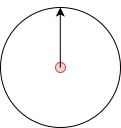
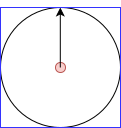

# Filtered search

Filters can be used to give the user of the website the possibility to narrow down his search by certain criteria that are offered to him. Filters can also be used to limit the search in general if the results can only be returned from a certain area. The CMS IES recognizes various criteria that can be used for this purpose.

The filters are specified via the input attribute `filter` in the form

```graphql
filter: [
   { filtertype: [ filtervalue, ... ] }
}
```

specified. Any number of filters can be defined. The individual filters are `AND`-linked so that they continue to narrow down the search results.

A filter can also be used multiple times to create an AND filter with two identical filters.

```graphql
filter: [
  { categories:["4749"] },
  { categories:["4767"] }
]
```

For almost all filters, a list of values can be specified according to which this filter should be filtered. These filter values are applied as `OR` filters. For an `OR` filter, the values can be summarized in a filter.

```graphql
filter: [
  { categories:["4749", "4767"] }
]
```

The example below filters for news articles that are linked to a specific category.

```graphql
filter: [
   { objectType: ["news"] },
   { categories: ["15949"] }
}
```

In the example below, the filter is applied to news articles that are linked to at least one of the two categories.

```graphql
filter: [
   { objectType: ["news"] },
   { categories: ["15949", "14961"] }
}
```

For more complex filter logic see [Complex filter](#complex-filter)

## Object type filter

Object types describe the different types of pages that are used in the website. These can be, for example, news pages, events, normal content pages or any other types that are part of the project.

```graphql
query {
  search(input: { filter: [{ objectTypes: ["news"] }] }) {
    total
    offset
    queryTime
    results {
      id
      name
      location
    }
  }
}
```

## Content section types filter

Content section types are types of sections that are included in a page. These can be text sections, image sections and all others that the project provides for the website. For example, a search can be defined in which all pages containing a YouTube video can be found.

```graphql
query {
  search(input: { filter: [{ contentSectionTypes: ["youtube"] }] }) {
    total
    offset
    queryTime
    results {
      id
      name
      location
    }
  }
}
```

## Categories filter

The CMS can be used to define any number of category trees that can be used to categorize articles.
These categories can be filtered using their ID. The hierarchy of the category is also taken into account. This means that if you filter by a category that has subcategories, the articles that are linked to the subcategory are also found.

```graphql
query {
  search(input: { filter: [{ categories: ["15949"] }] }) {
    total
    offset
    queryTime
    results {
      id
      name
      location
    }
  }
}
```

## Groups filter

In the CMS, articles are organized in hierarchical groups. For example, all articles in a rubric are managed in substructures of the rubric group. The groups filter can be used to restrict the search to groups. The hierarchy of the groups is also taken into account so that all articles in a group are found, even if they are contained in further nested subgroups.

```graphql
query {
  search(input: { filter: [{ groups: ["16811"] }] }) {
    total
    offset
    queryTime
    results {
      id
      name
      location
    }
  }
}
```

## Sites filter

Several websites can be managed within the CSM. These can be several main websites, but also microsites that are subordinate to a main website. The Sites filter can be used to restrict the search to a single site. For example, you can define a search that only returns hits from a microsite. Without this filter, a search for the main website can be realized, for example, in which the pages of the microsites are also found.

```graphql
query {
  search(input: { filter: [{ sites: ["3952"] }] }) {
    total
    offset
    queryTime
    results {
      id
      name
      location
    }
  }
}
```

## Ids filter

This filter can be used to search for a list of resources with specific IDs.

```graphql
query {
  search(input: { filter: [{ ids: ["1212"] }] }) {
    total
    offset
    queryTime
    results {
      id
      name
      location
    }
  }
}
```

## Date range filter

An editorial date can be maintained for articles. This date can be used for the search to filter articles. If there is no editorial date, the creation date of the article is used. Depending on the article type, a list of dates can also be maintained. This is the case for events, for example. Repeat dates are also possible here. All dates are then taken into account in the date range filter.

Date range filters can be defined as absolute date ranges or as relative date ranges. See [Date Ranges](index.md#date-ranges) for a detailed description of how these can be defined.

Example of a date range filter with absolute date values:

```graphql
query {
  search(
    input: {
      filter: [
        {
          absoluteDateRange: {
            from: "2024-05-21T22:00:00Z"
            to: "2024-05-22T21:59:59Z"
          }
        }
      ]
    }
  ) {
    total
    offset
    queryTime
    results {
      id
      name
      location
    }
  }
}
```

Example of a date range filter with relative date values based on the current date:

```graphql
query {
  search(
    input: { filter: [{ relativeDateRange: { before: "P1D", after: "P1W" } }] }
  ) {
    total
    offset
    queryTime
    results {
      id
      name
      location
    }
  }
}
```

## Spatial orbital Filter

The spatial orbital filter can be used to search for resources that are located within a certain area. The filter is defined by a center point and a radius.

The spatial orbital filter expects the following parameters:

`distance`

: The radius of the circle in kilometers.

`centerPoint`

: The center point of the circle. The point is defined by the latitude and longitude.

`mode`

: The mode of the filter. The mode can be `GREAT_CIRCLE_DISTANCE` or `BOUNDING_BOX`.

### Great circle distance

With the Great circle distance, you can retrieve results based on the spatial distance from a specific point. It can also be seen as creating a circular filter. This filter returns all results within a circle with the specified radius around the starting point.



```graphql
query {
  search(
    input: {
      filter: [
        {
          spatialOrbital: {
            distance: 20.0
            centerPoint: { lat: lng: 7.6286691, lat: 51.9651620 }
            mode: GREAT_CIRCLE_DISTANCE
          }
        }
      ]
    }
  ) {
    total
    offset
    queryTime
    results {
      id
      name
      location
    }
  }
}
```

### Bounding box

The "Bounding box" filter is very similar to the "Great circle distance" filter, except that it uses the bounding box of the calculated circle. See the blue frame in the diagram below.

The rectangular shape is faster to calculate and is therefore sometimes used as an alternative to "Great circle distance" when it is acceptable to return points outside the radius.



```graphql
query {
  search(
    input: {
      filter: [
        {
          spatialOrbital: {
            distance: 2.0
            centerPoint: { lng: 7.6286691, lat: 51.9651620 }
            mode: BOUNDING_BOX
          }
        }
      ]
    }
  ) {
    total
    offset
    queryTime
    results {
      id
      name
      location
    }
  }
}
```

## Spatial Arbitrary rectangle Filter

Sometimes the spatial search must find everything in a rectangular area, e.g. the area covered by a map that the user is currently looking at. In this case, [Spatial orbital filter](#spatial-orbital-filter) is not sufficient.

In this case, the Arbitrary rectangle filter can be used to specify the lower left corner as the start of the range and the upper right corner as the end of the range.

`lowerLeftCorner`

: The lower left corner of the rectangle. The point is defined by the latitude and longitude.

`upperRightCorner`

: The upper right corner of the rectangle. The point is defined by the latitude and longitude.


```graphql
query {
  search(
    input: {
      filter: [
        {
          spatialArbitraryRectangle: {
            lowerLeftCorner: { lat: 51.9635354, lng: 7.6217852 }
            upperRightCorner: { lat: 51.9711239, lng: 7.6407538 }
          }
        }
      ]
    }
  ) {
    total
    offset
    queryTime
    results {
      id
      name
      location
    }
  }
}
```

## Including markted as archived

Articles can be marked as achrivated in the CMS. This flag ensures that these articles are not normally included in the search. This can be used for news, for example, to include only the latest news in the general search. For a special search, such as a news archive search, the "Including marked as archived" filter can be used to also find archived articles.

```graphql
query {
  search(input: { filter: [{ objectTypes: ["news"] }, { archive: true }] }) {
    total
    offset
    queryTime
    results {
      id
      name
      location
    }
  }
}
```

## Complex filter

Complex filter queries can be constructed by combining one or more queries using `and`, `or` or `not` queries.

An `and` or `or` query expects a list of filters.

### And

```graphql
filter: [{ and : [
  { objectTypes: ["news"] },
  { sites: ["3952"] }
]}]
```

### Or

```graphql
filter: [{ or : [
  { objectTypes: ["news"] },
  { sites: ["3952"] }
]}]
```

### Not

`not` expects a filter definition

```graphql
filter: [{ not : {
  objectTypes: ["news"]
}}]
```

### Combined

These can be combined as required:

```graphql
filter: [{ and : [
  { objectTypes: ["news"] },
  {
    or : [
      { groups: ["16811"] },
      { groups: ["16812"] },
      { and : [
          { categories: ["15949"] },
          { not : {
            categories: ["15950"]
          } }
      ] }
    ]
  },
  { sites: ["3952"] }
]}]
```

## Query filter

This filter accepts a query that is passed directly to the search engine. This filter should only be used in absolute exceptions where the fields of the current schema must be specified directly.

!!! warning

    If the schema is changed, the specified queries for these filters may no longer work.

```graphql
filter: [{
  query : "sp_objecttype:content"
}]
```

## Filter key

A `key` can also be specified for filters. This is only necessary if the filter only influences the facet search. The key is then used for the faceted search to identify the filters that must not be taken into account. See [Facet search](faceted-search.md)

```graphql
filter: [
   { key: "articletypes", objectType: ["news"] }
}
```
